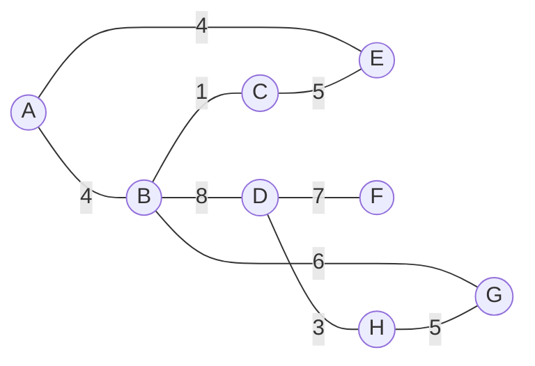

# Algorithms and Data Structures - Prim

## Characteristics
- Time complexity: O(E log V) where E is the number of edges and V is the number of vertices.
  - Because Prim's algorithm uses a priority queue to select the minimum weight edge, which takes O(log V) time for each edge.
- Space complexity: O(V + E) for storing the graph and the MST.

## Demos

[Implementation](./src/prim.py)

## References
- [Other Algorithms & Data Structures](https://github.com/NelsonBN/algorithms-data-structures)
